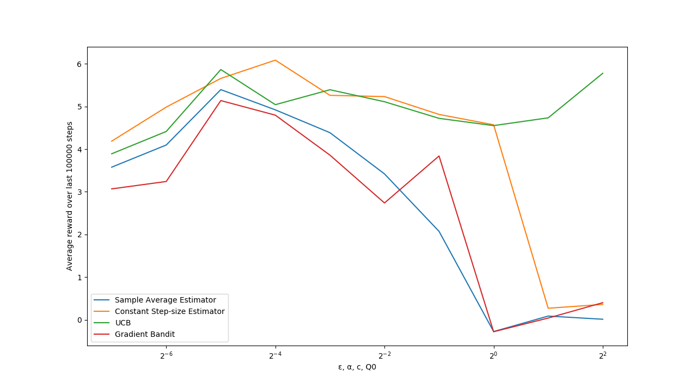

# Exercise 2.9

## Question:
(programming) Make a figure anologous to Figure 2.6 for the non-stationary case outlined
in Exercise 2.5. Include the constant step-size ε-greedy algorithm with α = 0.1. Use runs
of 200,000 steps and, as performance measure for each algorithm and parameter setting, use
the average reward over the last 100,000 steps.

## Answer:
Run code/Exercise 2.9.py

